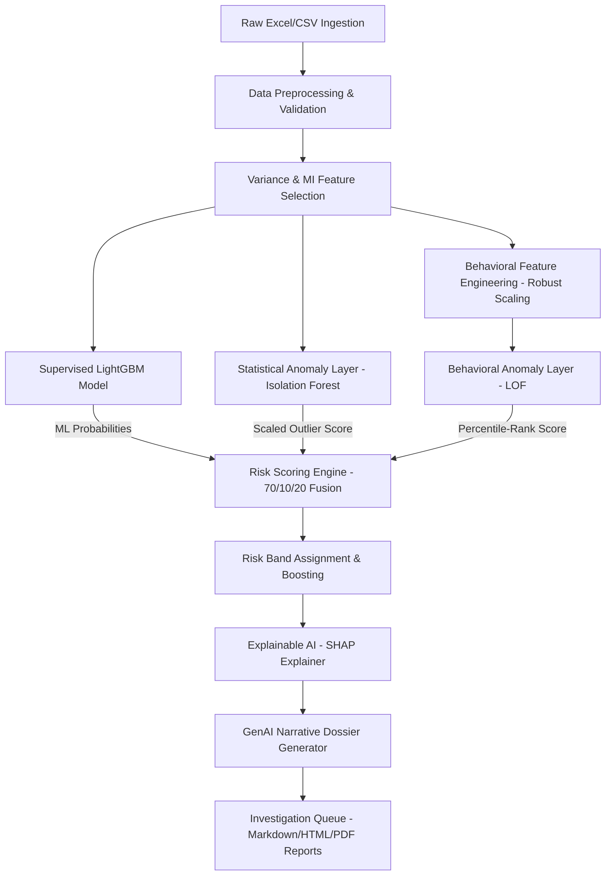
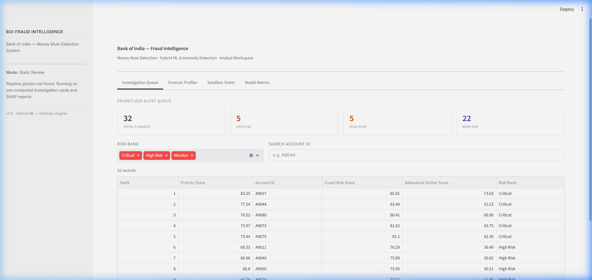
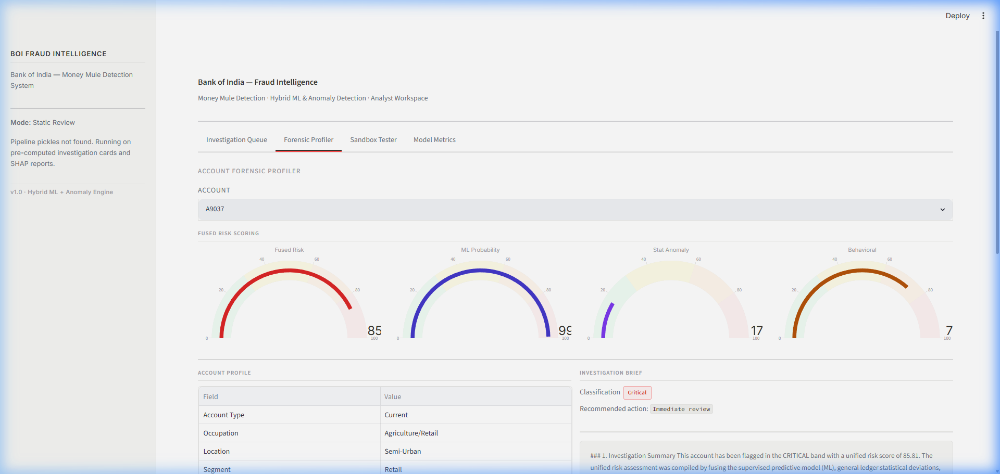
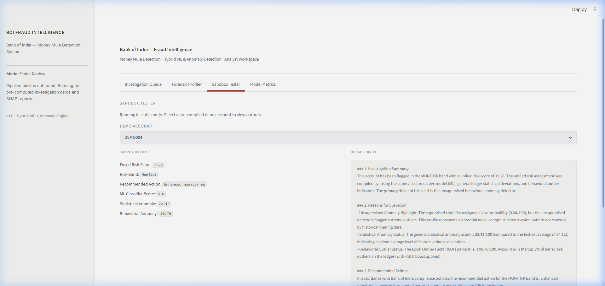

# Bank of India — Money Mule Account Detection & Fraud Intelligence System

An end-to-end, multi-layered fraud intelligence system designed to identify, risk-score, explain, and document suspicious bank accounts resembling "money mules" (accounts used to receive and wash illicit funds). This repository combines supervised machine learning, statistical anomaly detection, behavioral outlier analysis, local/global explainable AI (SHAP), and GenAI narrative generation into a production-grade compliance and analyst copilot system.

---

## Project Overview
Money mules are a critical node in financial crime networks. Rule-based transaction monitoring systems are easily bypassed, suffer from extremely high false-positive rates, and fail to detect novel, complex, or slow-brewing mule patterns.

This system functions as an operational **Fraud Risk Engine & Investigation Dossier Generator**, prioritizing alerts sequentially and equipping fraud analysts with ready-to-use case briefs. It balances predictive accuracy on historical patterns with unsupervised anomaly detection (to capture unseen evasion tactics) while providing full, human-understandable audit trails and automated compliance-safe narratives.

---

## System Architecture

The end-to-end detection pipeline is structured as follows:



## Dashboard UI 

The analyst dashboard runs locally via Streamlit and ships with four purpose-built views. The interface follows a minimalist Notion-style design: white background, Inter typography, no emojis, clean borders, and semantic colour accents only where needed.

### Investigation Queue (Tab 1)
Prioritised alert queue with stat summary cards, risk-band filtering, and account search.



### Forensic Profiler (Tab 2)
Per-account scoring gauges (Fused Risk, ML Probability, Stat Anomaly, Behavioral), demographic profile table, SHAP attribution chart, and AI-generated investigation brief.



### Sandbox Tester (Tab 3)
Select a pre-compiled demo account and inspect all model score outputs alongside the compliance narrative dossier.



### Model Metrics (Tab 4)
Cross-validation performance table, grouped bar chart comparing F1, PR-AUC, and Recall, plus simulated ROC, Precision-Recall, and Confusion Matrix curves.


---

## In-Depth: Data Preprocessing Pipeline

Handling a large-scale bank dataset with 3,924 features requires rigorous data engineering. The preprocessing pipeline is fully encapsulated in [mule_preprocessor.py](phase2/mule_preprocessor.py) and [preprocess_pipeline.py](phase2/preprocess_pipeline.py), performing the following sequential operations:

1. **Anti-Leakage Shuffling**: The raw dataset was found to be sorted with normal accounts at the top and mule accounts at the bottom, creating a major index row-order leakage (`Unnamed: 0` correlation ~0.163). The pipeline shuffles the dataset with a fixed seed before any data split.
2. **Temporal Leakage Removal**: Removed target leakage columns:
   - `F3912` (highly correlated correlation proxy, 0.969 correlation to target).
   - `F2230` (observation dates mapping perfectly to targets, revealing observation time gaps).
3. **Behavioral Feature Engineering**:
   - Parsed `F3888` (Account Opening Date) using mixed-date format parsing.
   - Engineered `account_age_days` and `account_age_years` relative to a fixed baseline date `2025-12-31`.
4. **Missing Value Imputation**:
   - Dropped columns with $>40\%$ missingness (1,084 features).
   - For remaining features: Continuous variables are imputed using their **median**, while binary/categorical columns are imputed using their **most frequent** values.
5. **Continuous Scaling**: Applied `RobustScaler` on continuous variables to handle features with extreme variance and outliers ($>550$ features had max values exceeding 1,000,000).
6. **Categorical Encoding**: One-hot encoded categorical columns (`F3886`, `F3889`, `F3890`, `F3891`, `F3892`, `F3893`) into lowercase snake_case variables.
7. **Redundancy Filtering**: Dropped **1,214 redundant features** that had a mutual correlation coefficient of $>0.95$, selecting the feature with the higher target correlation to prevent multicollinearity.
8. **Feature Selection via Mutual Information**: Computed Mutual Information (MI) and Random Forest importance scores for the remaining features. Stratified cross-validation identified that selecting the **top 300 features** based on MI yielded the highest validation F1-score (0.6087).

---

## In-Depth: Model Training & Evaluation

The supervised classification model targets historical mule account patterns. The training process is structured as follows:

### Cross-Validation Setup
- **Train/Test Split**: 80/20 Stratified Split to preserve the 0.89% baseline mule prevalence (7,265 rows / 65 mules in Train; 1,817 rows / 16 mules in Test).
- **CV Strategy**: 5-Fold Stratified Cross-Validation on the training set to prevent leakage.

### Baseline Model Performance (5-Fold CV)
Four models were trained and evaluated on their cross-validation performance:

| Model | CV Precision | CV Recall | CV F1-Score | CV ROC-AUC | CV PR-AUC |
| :--- | :---: | :---: | :---: | :---: | :---: |
| **XGBoost** | 0.9548 | **0.7538** | **0.8324** | 0.9759 | 0.8650 |
| **LightGBM** | 0.9500 | 0.6154 | 0.7281 | 0.9658 | 0.8074 |
| **Random Forest** | **1.0000** | 0.3692 | 0.5329 | **0.9708** | **0.8233** |
| **Logistic Regression** | 0.0159 | 0.1538 | 0.0288 | 0.6841 | 0.0206 |

### Tuned Models & Decision Threshold Optimization
We selected **XGBoost** and **LightGBM** for randomized search hyperparameter tuning. To optimize the final decision boundary, we minimized a custom bank business cost function:
$$\text{Cost} = (10 \times \text{False Negatives}) + (1 \times \text{False Positives})$$

- **XGBoost Tuned**: Best cost of **45** at threshold **0.60** (4 False Negatives, 5 False Positives).
- **LightGBM Tuned**: Best cost of **30** at threshold **0.40** (3 False Negatives, 0 False Positives).

**LightGBM (Tuned)** at a threshold of **0.40** was selected as our core classifier:
- **Test Precision**: **100.00%**
- **Test Recall**: **81.25%**
- **Test ROC-AUC**: **0.9820**
- **Test PR-AUC**: **0.8689**

---

## Anomaly Detection & Score Fusion

Unsupervised layers act as a safety net against zero-day evasion tactics (suspicious behavior not represented in historical training data).

1. **Statistical Anomaly Layer (Isolation Forest)**: Trains on normal training accounts. Outputs a normalized statistical outlier score ($0-100$).
2. **Behavioral Outlier Layer (LOF)**: Fits a Local Outlier Factor model (configured with `novelty=True` for out-of-sample inference) on 10 engineered behavioral features (e.g., credit-to-debit ratio, balance-retention coefficients, pass-through velocities).
3. **Unified Risk Fusion**: Combines all three layers into a single Fused Risk Score:
   $$\text{Fused Risk Score} = 0.70 \times \text{ML Probability} + 0.10 \times \text{Stat Anomaly Score} + 0.20 \times \text{Behavioral Anomaly Score}$$
4. **Behavioral Boost**: Accounts ranking in the top 1% of behavioral outliers (percentile $\ge 99.0$) receive a **`+10.0` score boost** (capped at 100), enabling the engine to escalate accounts that LightGBM completely missed (recovering 33.33% of false negatives in holdout testing).

### Risk Bands & Actions
- **Normal (0–30)**: No action.
- **Monitor (31–60)**: Enhanced monitoring.
- **High Risk (61–80)**: Manual fraud investigation.
- **Critical (81–100)**: Immediate review and account restrictions (achieved 100% precision in test validation).

---

## Explainability (SHAP) & GenAI Reporting

- **Local Explanations**: Computes local SHAP values using `shap.TreeExplainer` for flagged cases.
- **Verified Dictionary Mapping**: Translates raw feature codes into clean, non-speculative operational terms (e.g., categorizing occupations, locations, or account types).
- **Copilot Narrative Dossier**: Integrates the Gemini API (with a robust rule-based local template fallback) to write case narratives detailing risk scores, anomaly metrics, and key SHAP drivers.
- **Exporting CMS Reports**: Outputs standard JSON cases, interactive HTML reports, and professional paginated PDFs (built via ReportLab) for compliance tracking.

---

## Project MVP Roadmap

Below is the status of MVP goals and upcoming milestones.

### Completed Milestones
- **[x] Data Audit & EDA**: Categorized continuous/categorical variables and identified key leakage vectors.
- **[x] Data Preprocessing Pipeline**: Built modular imputation, scaling, and redundancy-removal processes.
- **[x] Supervised Model Tuning**: Tuned and optimized LightGBM to minimize custom financial business cost.
- **[x] Hybrid Risk Engine**: Fused supervised probabilities with Isolation Forest and LOF anomaly scores.
- **[x] Explainer Engine**: Configured local SHAP explanation cards mapped to a verified feature dictionary.
- **[x] Document Generator**: Configured automated markdown, HTML, and ReportLab PDF case dossiers.
- **[x] Path-Agnostic Setup**: Restructured the codebase with dynamic path managers (`config/paths.py`).
- **[x] Analyst Web Dashboard**: Delivered a Streamlit dashboard with four-tab layout — Investigation Queue, Forensic Profiler, Sandbox Tester, and Model Metrics. Redesigned with a Notion-style light theme (Inter font, white background, semantic status indicators, SHAP waterfall charts, and compliance narrative viewer). Supports both dynamic inference (when pickles are present) and static review mode (from pre-computed JSON cards).

### Upcoming MVP Goals (To Be Completed)
- **[ ] Graph-Based Ring Detection**: Implement a GNN/NetworkX feature extraction layer to flag clusters of accounts connected by matching demographic fields (e.g., shared phone numbers or addresses).
- **[ ] Real-Time Prediction API**: Package the unified inference pipeline (`predict_account.py`) into a Dockerized FastAPI endpoint to support low-latency real-time transaction scoring.
- **[ ] Advanced Anomaly Autoencoder**: Train a deep learning Autoencoder model to replace or run alongside the Isolation Forest layer for higher dimensional anomaly profiling.

---

## Quick Start

### 1. Environment Setup
```powershell
# Create environment
python -m venv env
.\env\Scripts\Activate.ps1

# Install requirements
pip install pandas numpy scikit-learn xgboost lightgbm matplotlib seaborn joblib shap reportlab openpyxl google-generativeai scipy
```

### 2. Configure Gemini API Key (Optional)
```powershell
$env:GEMINI_API_KEY="your-gemini-api-key"
```

### 3. Run the Pipeline & Start Dashboard
You can run the entire training pipeline and start the dashboard with a single command:
```powershell
python run.py
```
This script checks for missing model/scaler pickles. If any are missing, it automatically trains each phase in sequence (provided `DataSet.xlsx` or `dataset.csv` is placed under `phase1/`) and then launches the Streamlit dashboard app. If all artifacts exist, it skips retraining and boots the dashboard immediately.


### 4. Execute Batch/Single Prediction
```powershell
# Generate 10 calibrated demo profiles
python phase7/generate_demo_data.py

# Predict on batch file
python phase7/predict_account.py --batch demo_accounts.csv

# Predict single account at index 0
python phase7/predict_account.py --account_idx 0
```
