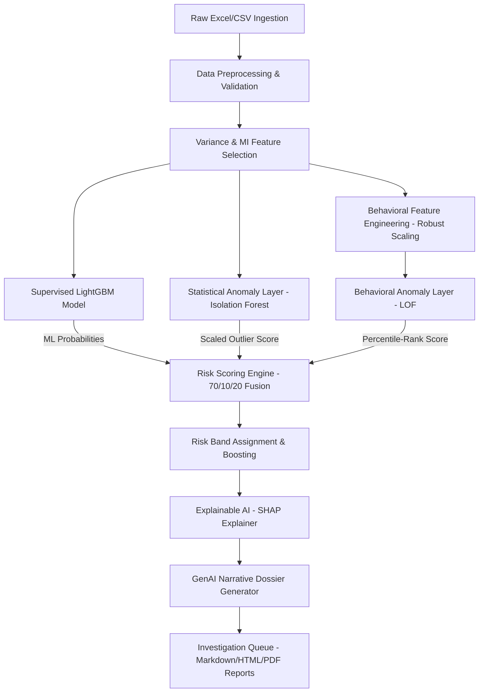

# Bank of India — Money Mule Account Detection & Fraud Intelligence System

An end-to-end, multi-layered fraud intelligence system designed to identify, risk-score, explain, and document suspicious bank accounts resembling "money mules" (accounts used to receive and wash illicit funds). This repository combines supervised machine learning, statistical anomaly detection, behavioral outlier analysis, local/global explainable AI (SHAP), and GenAI narrative generation into a production-grade compliance and analyst copilot system.

---

## 1. Project Overview
- **Problem Statement**: Money mules are a critical node in financial crime networks. Rule-based transaction monitoring systems are easily bypassed, suffer from extremely high false-positive rates, and fail to detect novel, complex, or slow-brewing mule patterns.
- **Objective**: Detect suspicious accounts by combining supervised predictive accuracy with unsupervised anomaly detection (to capture unseen evasion tactics) while providing full, human-understandable audit trails (SHAP explainability) and automated narrative summaries (GenAI).
- **End Goal**: Rather than outputting a simple binary classifier (0/1), this system functions as an operational **Fraud Risk Engine & Investigation Dossier Generator**, prioritizing alerts sequentially and equipping fraud analysts with ready-to-use case briefs.

---

## 2. System Architecture

The end-to-end detection pipeline is structured as follows:



1. **Data Ingestion**: Standardizes bank-provided ledger transactions.
2. **Feature Engineering**: Imputes missing values, scales features, removes temporal leakage, and builds custom behavioral indices.
3. **Model Training (Classification)**: Trains a supervised LightGBM model to identify historical fraud patterns.
4. **Anomaly Detection Layer**: Captures statistical anomalies (via Isolation Forest) and behavioral outlier patterns (via Local Outlier Factor).
5. **Risk Scoring Engine**: Fuses ML probability, statistical anomaly, and behavioral anomaly scores into a single unified risk score.
6. **Explainability (SHAP)**: Computes local and global feature attributions to provide transparent reasons for suspicion.
7. **GenAI Report Generation**: Integrates the Gemini API (with deterministic fallback) to generate narrative investigator case dockets.
8. **Dashboard Output System**: Exports formatted Markdown, HTML, and paginated PDF dossiers for case management systems (CMS).

---

## 3. Dataset Description
- **Source**: Bank-provided transactional and account profile datasets.
- **Size**: **9,082 rows** × **3,924 features** (including demographic indicators, ledger activities, and transaction history).
- **Target Variable**: `F3924` (1 for identified Money Mule, 0 for Normal Account).
- **Class Imbalance**: Highly imbalanced dataset (**81 mule accounts, 9,001 normal accounts | ratio ~111:1**). Primary metrics are Recall, Precision, PR-AUC, and Cost.
- **Key Feature Groups**:
  - **Demographics & Profile**: Occupation, area/category, customer segment, account type.
  - **Transaction Ledger**: Credit/debit velocities, balance volumes, monthly averages.
  - **Behavioral Ratios**: Credit-to-debit ratios, balance-retention coefficients, pass-through velocities.

---

## 4. Phase 1 – Data Understanding
- **Dataset Audit**: Audited missing values (30% of features were sparse with >40% missingness) and confirmed 0 duplicate rows.
- **Target Analysis**: Established baseline prevalence (0.89%) to guide model selection and thresholding.
- **Feature Categorization**: Categorized the 3,924 columns into 526 binary features, 381 categorical features, and 2,657 continuous features.
- **Outlier Audits**: Identified 551 features with extreme variances (>1,000,000 max values), necessitating Robust/Standard scaling.

---

## 5. Phase 2 – Feature Engineering & Reduction
- **Temporal Leakage Removal**: Removed target leakage columns:
  - `F3912` (highly correlated correlation proxy, 0.969).
  - `F2230` (observation dates mapping perfectly to targets).
  - Row order leakage (`Unnamed: 0` index sorted normal vs. mule). Shuffled rows.
- **Dimensionality Reduction**:
  - Dropped constant features (zero-variance).
  - Dropped sparse columns (>40% missingness).
  - Dropped highly correlated duplicate pairs (e.g. `F2506`/`F2507`).
  - Applied **Mutual Information (MI)** feature screening to select the **top 300 features** for model training.

---

## 6. Phase 3 – Model Development
- **Supervised Models Evaluated**:
  - Logistic Regression (Baseline)
  - Random Forest
  - XGBoost (using `scale_pos_weight` to address imbalance)
  - LightGBM (Tuned)
- **Tuning Strategy**: 5-fold Stratified Cross-Validation on the training set, optimizing for Recall and PR-AUC.
- **Performance Evaluation Matrix (Test Set)**:
  
  | Model | Test Recall | Test Precision | Test F1-Score | Test ROC-AUC | Test PR-AUC | FN Count | Cost (10×FN + FP) |
  | :--- | :---: | :---: | :---: | :---: | :---: | :---: | :---: |
  | **LightGBM** | **81.25%** | **100.00%** | **0.8966** | **0.9820** | **0.8689** | **3** | **30** |
  | XGBoost | 75.00% | 70.59% | 0.7273 | 0.9769 | 0.7909 | 4 | 45 |

- **Decision Rule**: Threshold optimized at **`0.40`** to minimize false negatives while maintaining high precision.

---

## 7. Phase 4 & 4B – Anomaly Detection Layers
Unsupervised anomaly detection captures suspicious accounts that do not conform to historical training data (protecting against zero-day evasion tactics).

1. **Statistical Anomaly (Phase 4)**:
   - **Model**: Isolation Forest trained on normal training accounts.
   - **Score**: Scaled using a fitted MinMaxScaler [isolation_forest_scaler.pkl](file:///c:/Projects/bank_of_India/mule_account_detection/phase4/isolation_forest_scaler.pkl) to output a business-friendly score (0–100).
2. **Behavioral Outlier (Phase 4B)**:
   - **Model**: Local Outlier Factor (LOF) fit on engineered behavioral features (Account Age, occupation/area risk, credit/debit ratio, balance-retention, and pass-through ratios).
   - **LOF Compatibility**: Trained with `novelty=True` to support out-of-sample scoring on new transaction streams.

---

## 8. Phase 5 – Risk Scoring Engine
The risk engine fuses supervised and unsupervised layers:

$$\text{Fused Risk Score} = 0.70 \times \text{ML Probability} + 0.10 \times \text{Stat Anomaly Score} + 0.20 \times \text{Behavioral Anomaly Score}$$

- **Outlier Boosting**: Fused scores receive a **`+10.0` boost** if the account is in the top 1% of behavioral outliers (percentile $\ge 99.0$), capped at 100.
- **Risk Bands & Actions**:
  - **Normal (0–30)**: *No action*
  - **Monitor (31–60)**: *Enhanced monitoring*
  - **High Risk (61–80)**: *Manual fraud investigation*
  - **Critical (81–100)**: *Immediate escalation for review and restrictions*

---

## 9. Phase 6 – Explainable AI (SHAP)
- **Local Explanations**: Computes SHAP values on-the-fly for flagged accounts using `shap.TreeExplainer`.
- **Reason Codes**: Extracts the top 5 positive and negative feature drivers and maps them to clean descriptive labels via a verified feature dictionary. This ensures investigators know exactly why the engine flagged an account.

---

## 10. Phase 7 – GenAI Investigation Assistant
- **Automated Dossier Dossiers**: Feeds risk scores, anomaly metrics, and SHAP contributors into a structured LLM template.
- **Compliance & Terminology Rules**:
  - Never guesses anonymous F-codes (explains them strictly using verified dictionary metadata).
  - Uses probabilistic language (no direct accusations of fraud).
- **CMS Document Export**: Exports narrative summaries, reasons for suspicion, and banking actions as individual JSON case files, a consolidated Markdown docket, and a paginated ReportLab PDF investigator dossier.

---

## 11. Key System Features
- **Hybrid Fusion**: Merges classification with statistical/behavioral outliers.
- **Prioritized Alert Queue**: Ranks flagged cases by priority score:
  $$\text{Priority Score} = 0.80 \times \text{Fused Risk Score} + 0.20 \times \text{Behavioral Score}$$
- **Anti-Accusation Compliance**: Validates AI-generated copy to ensure safety.
- **Explainability-First**: Direct traceback of individual flags to tabular values.

---

## 12. Outputs Generated

The pipeline saves final deliverables under `phase7/`:
- [predictions.csv](file:///c:/Projects/bank_of_India/mule_account_detection/phase7/predictions.csv): Fused results table for batch ingest.
- [reports.json](file:///c:/Projects/bank_of_India/mule_account_detection/phase7/reports.json): Narrative investigation reports.
- [investigator_report.pdf](file:///c:/Projects/bank_of_India/mule_account_detection/phase7/investigator_report.pdf): Paginated, formatted PDF docket (via ReportLab).
- [investigator_report.html](file:///c:/Projects/bank_of_India/mule_account_detection/phase7/investigator_report.html): Responsive web dossier.
- [investigation_queue.csv](file:///c:/Projects/bank_of_India/mule_account_detection/phase7/investigation_queue.csv): Ranked alert queue.
- `case_AXXXX.json`: Ingestible case files for case management integrations.

---

## 13. Tech Stack
- **Languages & Utilities**: Python 3.x
- **Data Engineering**: Pandas, NumPy, OpenPyXL, SciPy
- **Modeling**: Scikit-Learn (Logistic Regression, Random Forest, Isolation Forest, LOF, MinMaxScaler, RobustScaler), XGBoost, LightGBM
- **Explainability**: SHAP
- **Reporting**: ReportLab (PDF), HTML5, Markdown
- **GenAI Layer**: `google-generativeai` SDK (Gemini API)

---

## 14. Steps to Recreate the Entire Pipeline

Follow these steps to set up the environment, recreate the datasets, retrain all models, and run predictions.

### Step 1: Clone and Environment Setup
Create a Python virtual environment and activate it:
```powershell
# Create environment
python -m venv env

# Activate environment (Windows PowerShell)
.\env\Scripts\Activate.ps1
```

Install the required dependencies:
```powershell
pip install pandas numpy scikit-learn xgboost lightgbm matplotlib seaborn joblib shap reportlab openpyxl google-generativeai scipy
```

*(Optional)* Configure your Gemini API Key if you want to use the GenAI narrative generation layer (if not present, the scripts automatically fall back to a high-quality local rule-based template engine):
```powershell
$env:GEMINI_API_KEY="your-gemini-api-key-here"
```

### Step 2: Run the Pipeline in Order
To ensure proper dependencies (models, scalers, and data indices are built in order), run the following scripts:

1. **Rebuild Preprocessing Pipeline & Cleanup (Phase 2)**:
   This performs cleaning, feature selection, and exports `X_final.csv`, `y_final.csv`, and the preprocessor pickle.
   ```powershell
   python phase2/preprocess_pipeline.py
   ```

2. **Train Classification Models & Optimize Decision Threshold (Phase 3)**:
   This splits the dataset (80/20 train/test), trains the baseline models, tunes LightGBM/XGBoost, selects the best model, and saves `best_model.pkl` and `best_threshold.json`.
   ```powershell
   python phase3/train_model.py
   ```

3. **Train Statistical Anomaly Layer (Phase 4)**:
   This trains the Isolation Forest on normal training accounts and exports the model and MinMaxScaler.
   ```powershell
   python phase4/anomaly_detection.py
   ```

4. **Engineer Behavioral Features & Train LOF Layer (Phase 4B)**:
   This generates behavioral ratio features, fits the RobustScaler, and trains the LOF classifier (`novelty=True`).
   ```powershell
   python phase4b/build_behavior_features.py
   python phase4b/behavioral_anomaly_detection.py
   ```

5. **Generate ML risk scores & Calibrate Fused Risk Engine (Phase 5)**:
   This predicts ML scores on the test set and fuses ML, statistical, and behavioral scores.
   ```powershell
   python phase5/generate_ml_scores.py
   python phase5/generate_risk_scores.py
   ```

6. **Generate SHAP Explanations & Reason Codes (Phase 6)**:
   This computes local SHAP values and exports the feature importance cards.
   ```powershell
   python phase6/generate_explanations.py
   ```

7. **Compile GenAI Dossiers & Prioritized Queues (Phase 7)**:
   This generates investigator dossiers (Markdown, HTML, PDF dockets) and creates individual CMS JSON case files.
   ```powershell
   python phase7/generate_genai_reports.py
   ```

### Step 3: Run Inference Validation Tests
To verify the inference pipeline's integration and performance on new out-of-sample data, execute the demo tests:

- **Generate Demo Account Profiles**:
  ```powershell
  python phase7/generate_demo_data.py
  ```
- **Execute Batch Inference Prediction**:
  Scores the demo accounts, applies fusion, checks alert budgets, and drafts reports.
  ```powershell
  python phase7/predict_account.py --batch demo_accounts.csv
  ```
- **Execute Single Account Prediction Card**:
  Pulls account at index 0 and outputs full SHAP details to `prediction.json`.
  ```powershell
  python phase7/predict_account.py --account_idx 0
  ```

---

## 15. Business Impact & Future Scope
- **Business Impact**:
  - **Early Warning**: Identifies mule accounts before significant fund diversion occurs.
  - **Prioritized Alerts**: Directs investigations using weighted prioritization, saving valuable time.
  - **Explainable Decisions**: Translates complex, high-dimensional metrics into plain investigator reason codes.
  - **Compliance-Ready Documentation**: Generates audit-ready PDF/HTML briefs for regulatory audits.
- **Future Scope**:
  - **Graph-Based Fraud Rings**: Incorporate graph-neural network (GNN) features to detect clusters of accounts connected by transfer paths.
  - **Real-Time Streaming Ingestion**: Deploy as a microservice using FastAPI/Docker with Apache Kafka for real-time transaction scoring.
  - **Deep Anomaly Models**: Integrate deep unsupervised learning models like Autoencoders or TabNet anomaly detectors.
